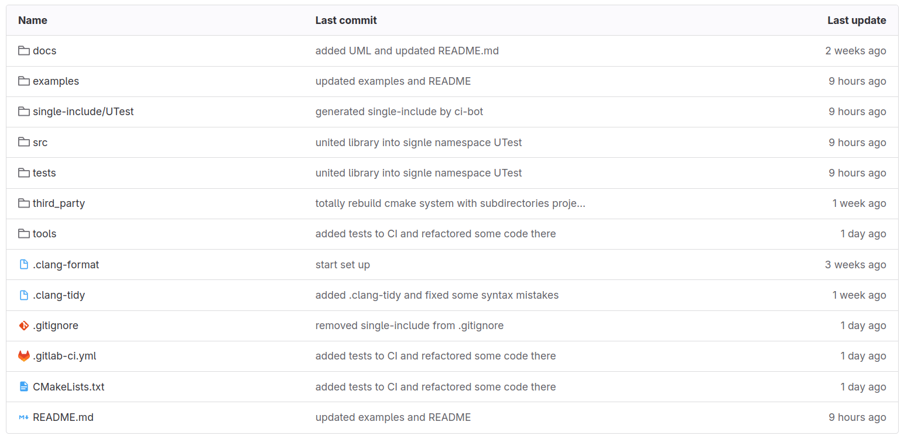
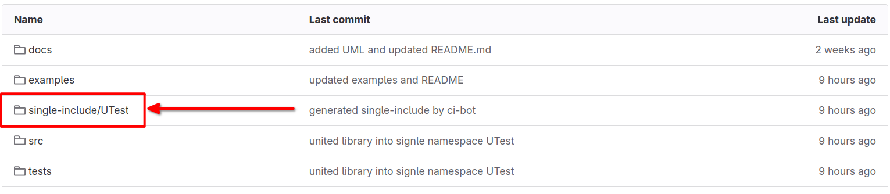
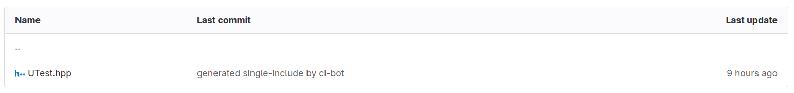
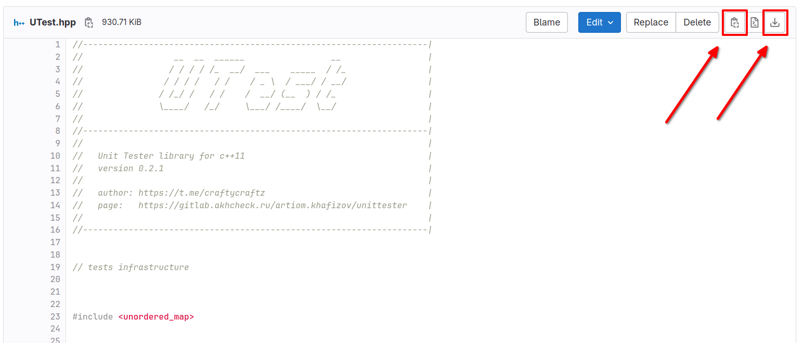

# UTest

_**Contents:**_

- [Description](README.md#description)
- [Usage](README.md#usage)
  - [Tests writing](README.md#tests-writing)
  - [Verification statements](README.md#asserts-and-expects)
  - [Collecting data](README.md#getting-data)
  - [Conversion to json (and back)](README.md#json-conversion)
- [Examples](README.md#examples)
- [Installation](README.md#installation)
  - [Single-include](README.md#single-include file)
  - [Git module](README.md#git-module)
- [Tests for UTest](README.md#running-tests-for-utest)
- [More docs links](README.md#extra-docs-links)


## Description

UTest is a user-friedly unit testing library based on C++11. The main purpose of this project is to provide a convenient and flexible way of writing tests and collecting information.

So here are key features of this library:

- [Simple test writing with `TEST` keyword](README.md#tests-writing)
- [Verification statements `ASSERT` and `EXPECT`](README.md#asserts-and-expects)
- [Collecting data from tests](README.md#getting-data)
- [Saving data to json (and back)](README.md#json-conversion)


## Usage

Here is a little tutorial of possible ways UTest usage, but first of all, you have to [install UTest](README.md#installation).

### Tests writing

Use `TEST` keyword to declare your own test. The first argument is name of this test, the second is the name of test group. For example:

```cpp
TEST(MyTestName, Common) {
    // some code in test
}
```

Test will register automatically, so that's all you need to do to create test.

_**Tips:**_

- It's more convenient to write tests for your project in different files. For example, split groups of tests into their own files. But don't forget to include tests into `main.cpp` where you can run them.

### Asserts and expects

You can use `ASSERT_TRUE` and `EXPECT_TRUE` keywords to verify some statement:

```cpp
TEST(MyTestName, Common) {
    ASSERT_TRUE(2 * 2 == 4)
    EXPECT_TRUE(5 != 7)
}
```

_**Features:**_

- You shouldn't put a semicolon (`;`) symbol after keywords (because they are macros at real).
- `ASSERT` statement _**will stop test execution**_ in case of fail, in opposite `EXPECT` will only indicate that statement inside was wrong. So code after failed `ASSERT` statement will be unreachable.
- `ASSERT` statements catch exceptions (because it stops test execution), when `EXPECT` throws exception again after it was caught.


### Test execution

When tests are done, you should execute them to get results. Use:

- `UTest::ExecuteTestAll()` to execute all tests
- `UTest::ExecuteTestGroup(std::string group_name)` to execute all tests by their group
- `UTest::ExecuteTest(std::string test_name)` to execute exact test

All of these methods return `UTest::TestResult` class object, that you can interact to.


### Getting data


### Json conversion 


## Examples

There are some examples of using UTest in `examples/` folder.

- `example_1`  is about tests running
- `example_2`  shows how to manage with `TestResult` objects and save them into json (and load)
- `example_3`  describes how set up auto-output and auto-saving into json

If you want to run one of them, use instruction:

1. Make temp folder in UTest repository like `build/` or `tmp/`
2. Move to it using `cd tmp` and run cmake: `cmake -DBUILD_EXAMPLES=ON ..`
3. Run `make`
4. Examples are built, so u need to choose one and run via `examples/<example_name>`


## Installation

There are several ways you can attach UTest library to your project.

- [Single-include](README.md#single-include file)
- [Git module](README.md#git module)


### Single-include file

That is the fastest and easiest way to integrate UTest.

_**Requirements:**_

- No requirements


_**Steps:**_

1. Open [repository](https://gitlab.akhcheck.ru/artiom.khafizov/unittester/) of UTest (or local directory if you have it downloaded already):
   

2. Go to "single-include/UTest" folder and find "UTest.hpp" file:
   You should see this:

   
   
3. Open it and find download or copy button:
   

4. Paste this file to your project folder

5. Now you can use UTest library via `#include "UTest.hpp"` in your project.
   (or `#include <UTest.hpp>`, it depends on CMake set up of your project).


### Git module

_**Requirements:**_
- You have to use [git](https://git-scm.com/) in your project repository
- You should use [CMake](https://cmake.org/) for building your project


_**Steps:**_

1. Open terminal in your local repository

2. Run `git submodule add https://gitlab.akhcheck.ru/artiom.khafizov/unittester.git` command - it will download UTest as [submodule](https://git-scm.com/docs/gitsubmodules) of your git repository.

3. Open your main `CMakeLists.txt` file

4. Add lines:

   - `add_subdirectory(unittester)`

   - `target_link_libraries(<your_lib/executable> UTestLibrary)`  like this:

     ```cmake
     cmake_minimum_required(VERSION 3.10)
     project(Example)
     
     set(CMAKE_CXX_STANDARD 11)
     
     add_subdirectory(unittester)
     
     add_executable(example_main main.cpp)
     target_link_libraries(example_main UTestLibrary)
     ```

5. Now you can use UTest library via `#include <UTest.hpp>`. For example:
   ```cpp
   #include <iostream>
   #include <UTest.hpp>
   
   TEST(HelloWorld, Common) {
     std::cout << "Hello, world!\n";
   }
   
   int main() {
     UTest::ExecuteTestAll();
     return 0;
   }
   ```


## Running tests for UTest

Clone UTest repository, create some folder inside for test build, for example `tmp/` or `build/`.

Move to this folder and run `cmake -DBUILD_TESTS=ON ..` and `make` after that. Now tests are built and you just need to use `tests/tests` for tests execution.

That's it! You have tested library for testing :)


## Extra docs links

- [Architecture of UTest library](docs/README.md)

