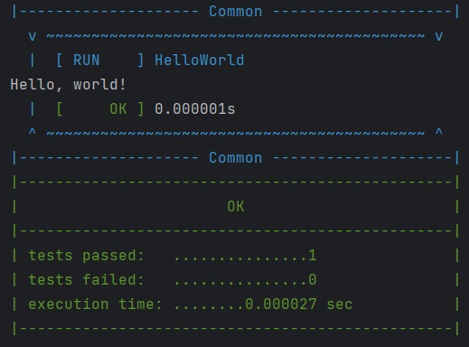

# UTest

_**Contents:**_

- [Description](README.md#description)
- [Usage](README.md#usage)
  - [Tests writing](README.md#tests-writing)
  - [Verification statements](README.md#asserts-and-expects)
  - [Collecting data](README.md#getting-data)
  - [Conversion to json (and back)](README.md#json-conversion)
- [Examples](README.md#examples)
- [Installation](README.md#installation)
  - [Single-include](README.md#single-include-file)
  - [Git module](README.md#git-module)
- [Tests for UTest](README.md#running-tests-for-utest)
- [More docs links](README.md#extra-docs-links)


## Description

UTest is a user-friedly unit testing library based on C++11. The main purpose of this project is to provide a convenient and flexible way of writing tests and collecting information.

So here are key features of this library:

- [Simple test writing with `TEST` keyword](README.md#tests-writing)
- [Verification statements `ASSERT` and `EXPECT`](README.md#asserts-and-expects)
- [Collecting data from tests](README.md#getting-data)
- [Saving data to json (and back)](README.md#json-conversion)


## Usage

Here is a little tutorial of possible ways UTest usage, but first of all, you have to [install UTest](README.md#installation).

### Tests writing

Use `TEST` keyword to declare your own test. The first argument is name of this test, the second is the name of test group. For example:

```cpp
TEST(MyTestName, Common) {
    // some code in test
}
```

Test will register automatically, so that's all you need to do to create test.

_**Tips:**_

- It's more convenient to write tests for your project in different files. For example, split groups of tests into their own files. But don't forget to include tests into `main.cpp` where you can run them.


### Asserts and expects

You can use `ASSERT_TRUE` and `EXPECT_TRUE` keywords ("commands" in this text) to verify some statement:

```cpp
TEST(MyTestName, Common) {
    ASSERT_TRUE(2 * 2 == 4)
    EXPECT_TRUE(5 != 7)
}
```

_**Features:**_

- You shouldn't put a semicolon (`;`) symbol after keywords (because they are macros at real).
- `ASSERT` statement _**will stop test execution**_ in case of fail, in opposite `EXPECT` will only indicate that statement inside was wrong. So code after failed `ASSERT` statement will be unreachable.
- `ASSERT` statements catch exceptions (because it stops test execution), when `EXPECT` throws exception again after it was caught.
- If `EXPECT` failed it's considered that test is `failed`, but in case of `ASSERT` failure test becomes `fatal_failed`. We can see this difference in `UTest::CommandStatus` class [here](README.md#status-classes).


### Test execution

When tests are done, they must be executed for getting results. Use:

- `UTest::ExecuteTestAll()` to execute all tests
- `UTest::ExecuteTestGroup(std::string group_name)` to run all tests of particular group
- `UTest::ExecuteTest(std::string test_name)` to execute exact test

All of these methods return `UTest::TestResult` class object, that you can interact to.

_**Log:**_

You should see execution log in `stdout` while tests execution in case `UTest::IsOStreamEnabled()` was true by the time the tests were run, also in `stderr` if `UTest::IsOCerrStreamEnabled()`.


### Getting data

Yeah, execution log while testing is really comfortable for reading, but what if you need to save all you have seen? UTest will help you to solve this problem. Here are some options of tests output:

- [stdout\stderr](README.md#stdout\stderr)  - UTest uses `std::cout` and `std::cerr` for displaying this

- `UTest::TestResult` - it's a flexible object that contains tests results

- Execution status classes like:

  - `UTest::TestGroupStatus`
  - `UTest::TestStatus`
  - `UTest::CommandStatus`

  These things are just simple data structs that will help you read information in code easily

- `.json` - static storage of tests output as a file


#### Stdout\stderr

By default UTest uses `std::cout` and `std::cerr` for displaying tests execution process. There are some options you can use to configure output:

- **Stdout:**
  - `UTest::ToggleOStream()` function toggles stdout output
  - `UTest::IsOStreamEnabled()` - true if stdout output enabled
- **Stderr:**
  - `UTest::ToggleOCerrStream()` - toggles stderr output
  - `UTest::IsOCerrStreamEnabled()` - shows is stderr output enabled
- **Other:**
  - `UTest::SwitchStreams()` - switches (stdout and stderr) streams by toggling stdout and stderr


Also there are a some _**cosmetic output settings**_ such as:

- **Console colors configuration:** here is the list of parameters you can specify to change log colors:
  Use `UTest::ConsoleColorsConfig::<parameter> = <value>` to change configuration.

  - `common_color` - color of log decoration (`"blue"` by default)
  - `group_passed_color` - color of tests group output block if it's succeeded (`"green"` by default)
  - `group_failed_color` - tests group block color in case of fail (`"red"` by default)
  - `test_start_color` - color that display run of test (`"blue"` by default)
  - `test_passed_color` - color displaying test passing (`"green"` by default)
  - `test_failed_color` - color representing failure of test (`"red"` by default)
  - `command_passed_color` - color of passed statement (like `ASSERT` or `EXPECT`) (`"yellow"` by default)
  - `command_failed_color` - color of failed statement (`"red"` by default)
  - `command_fatal_failed_color` - used for highlighting fatal failed `ASSERT`s (`"red"` by default)

  You can specify any of these parameters by values (_**colors**_) in list below:

  - `"reset"` - switches console color to default, `"black"`, `"red"`, `"green"`, `"yellow"`, `"blue"`, `"magenta"`, `"cyan"`, `"white"`, `"brightblack"`, `"brightred"`, `"brightgreen"`, `"brightyellow"`, `"brightblue"`, `"brightmagenta"`, `"brightcyan"`, `"brightwhite"`

- **Output configuration:** responsible for extra information in log

  - `is_failed_detailed` - if `true` shows all verifying statements of failed tests (`true` by default)
  - `is_always_detailed` - make UTest output every command of every test (`false` by default)
  - `is_command_failed_path_enabled` - shows path to failed command (`false` by default)
  - `is_test_failed_path_enabled` - shows path to failed test (`true` by default)


  You can use `UTest::OutputConfig::<parameter> = <true | false>` to change some settings


#### Test Result class


#### Status classes


#### Json files


- 

- `UTest::TestResult` - it's a flexible object in which you can write another tests or merge it with another `TestResult`, but - you serialize them into `.json` files and deserialize back

- Execution status classes like:

  - `UTest::TestGroupStatus`
  - `UTest::TestStatus`
  - `UTest::CommandStatus`

  These data structs have simple fields you can read easily. You can get object of status classes from `UTest::TestResult` by invoking it's `GetTestGroupStatusMap()` method.

- `.json` files. 


### Json conversion 


## Examples

There are some examples of using UTest in `examples/` folder.

- `example_1`  is about tests running
- `example_2`  shows how to manage with `TestResult` objects and save them into json (and load)
- `example_3`  describes how set up auto-output and auto-saving into json

If you want to run one of them, use instruction:

1. Make temp folder in UTest repository like `build/` or `tmp/`
2. Move to it using `cd tmp` and run cmake: `cmake -DBUILD_EXAMPLES=ON ..`
3. Run `make`
4. Examples are built, so u need to choose one and run via `examples/<example_name>`


## Installation

There are several ways you can attach UTest library to your project.

- [Single-include](README.md#single-include-file)
- [Git module](README.md#git-module)


### Single-include file

That is the fastest and easiest way to integrate UTest.

_**Requirements:**_

- No requirements


_**Steps:**_

1. Open [repository](https://gitlab.akhcheck.ru/artiom.khafizov/unittester/) of UTest (or local directory if you have it downloaded already):
   

2. Go to "single-include/UTest" folder and find "UTest.hpp" file:
   You should see this:

   
   
3. Open it and find download or copy button:
   

4. Paste this file to your project folder

5. Now you can use UTest library via `#include "UTest.hpp"` in your project.
   (or `#include <UTest.hpp>`, it depends on CMake set up of your project).


### Git module

_**Requirements:**_
- You have to use [git](https://git-scm.com/) in your project repository
- You should use [CMake](https://cmake.org/) for building your project


_**Steps:**_

1. Open terminal in your local repository

2. Run `git submodule add https://gitlab.akhcheck.ru/artiom.khafizov/unittester.git` command - it will download UTest as [submodule](https://git-scm.com/docs/gitsubmodules) of your git repository.

3. Open your main `CMakeLists.txt` file

4. Add lines:

   - `add_subdirectory(unittester)`

   - `target_link_libraries(<your_lib/executable> UTestLibrary)`  like this:

     ```cmake
     cmake_minimum_required(VERSION 3.10)
     project(Example)
     
     set(CMAKE_CXX_STANDARD 11)
     
     add_subdirectory(unittester)
     
     add_executable(example_main main.cpp)
     target_link_libraries(example_main UTestLibrary)
     ```

5. Now you can use UTest library via `#include <UTest.hpp>`. For example:
   ```cpp
   #include <iostream>
   #include <UTest.hpp>
   
   TEST(HelloWorld, Common) {
     std::cout << "Hello, world!\n";
   }
   
   int main() {
     UTest::ExecuteTestAll();
     return 0;
   }
   ```

6. You should see something similar to this:
   


## Running tests for UTest

Clone UTest repository, create some folder inside for test build, for example `tmp/` or `build/`.

Move to this folder and run `cmake -DBUILD_TESTS=ON ..` and `make` after that. Now tests are built and you just need to use `tests/tests` for tests execution.

That's it! You have tested library for testing :)


## Extra docs links

- [Architecture of UTest library](docs/README.md)

