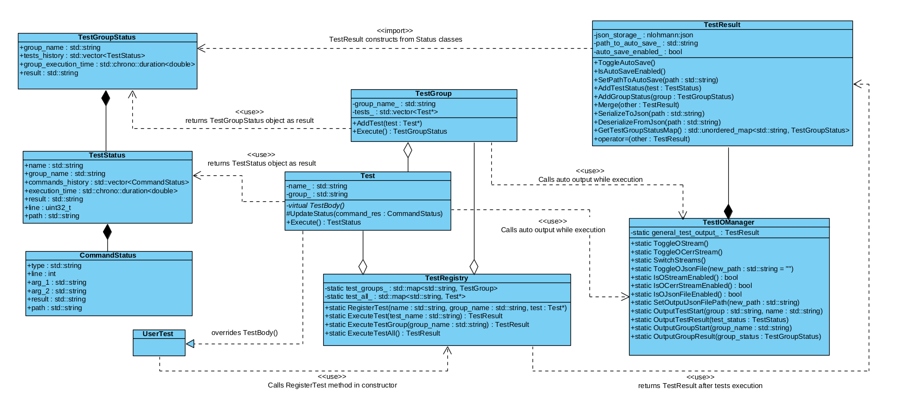

# Architecture of UTest library

Here you can read some info about UTest library internals.

_**UML scheme**_ of UTest logic structure:

It's important to notice, that scheme definitely isn't absolutely correct representation of UTest internal classes, but the purpose of UML is to show the basic interaction logic of structs inside library.

All these objects actually are wrapped up in special namespaces to prevent name conflicts.
